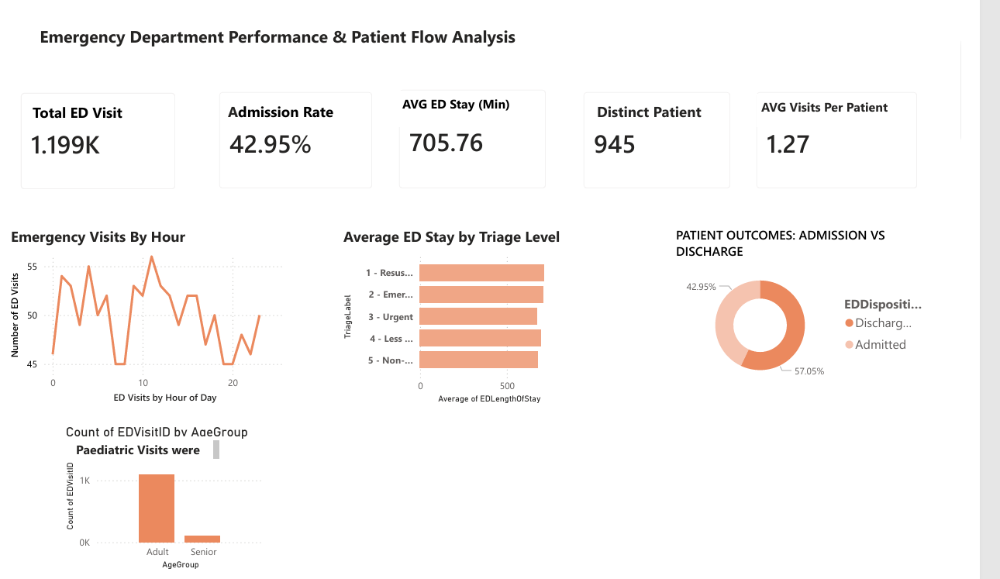
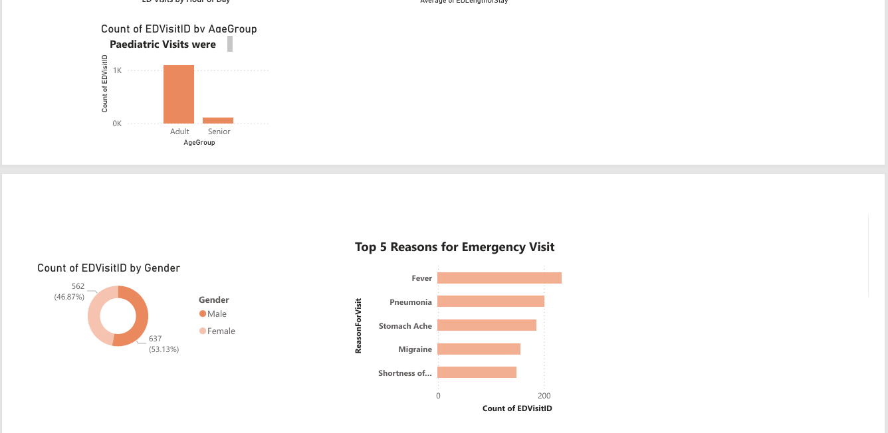

# 📊 Healthcare ED Analysis  
Emergency Department Data Analysis using Excel, SQL, and Power BI  

---

##  Overview  

This project analyzes Emergency Department (ED) operations using patient visit data to uncover trends in patient flow, resource utilization, and operational efficiency.  

The dataset was sourced from Kaggle, cleaned in Excel, transformed and queried using SQL, and visualized in Power BI.  

---

##  Objectives  

- Understand patient visit patterns  
- Analyze ED performance and wait times  
- Identify key drivers of ED demand  
- Evaluate admission and discharge trends  

---

##  Tools Used  

- Excel  
- MySQL  
- Power BI  

---

##  Dashboard  

### ED Overview  

[Download Full Dashboard (PDF)](ED_Analysis_power_BI_Report.pdf)

---

##  Key Insights  

###  Patient Flow  
ED visits are relatively stable throughout the day, indicating consistent demand rather than peak-driven pressure.  

### 🔹 Patient Demographics  
Adult patients account for the vast majority of visits, while no pediatric cases are recorded, suggesting dataset limitations.  

### 🔹 Patient Outcomes  
Approximately 57% of visits result in discharge, indicating that most cases are non-critical and may be managed outside the ED.  

### 🔹 Operational Efficiency  
ED length of stay averages 11–12 hours across all acuity levels, suggesting system-wide delays rather than severity-based prioritization.  

### 🔹 Visit Drivers  
Top reasons for visits include fever, pneumonia, and stomach-related complaints, reflecting a mix of infectious and non-critical conditions.  

---

##  Key Takeaways  

- A significant proportion of ED visits are non-critical  
- Long wait times indicate potential operational inefficiencies  
- Repeat visits suggest possible gaps in follow-up care or access to primary healthcare  

---

##  Data Limitations  

- Visit time lacked full date information, requiring adjustments  
- No pediatric data available in the dataset  
- Dataset may not fully reflect real-world hospital complexity  

---

##  Conclusion  

This analysis highlights opportunities to improve ED efficiency, optimize resource allocation, and reduce unnecessary emergency visits through improved access to primary care services.  
